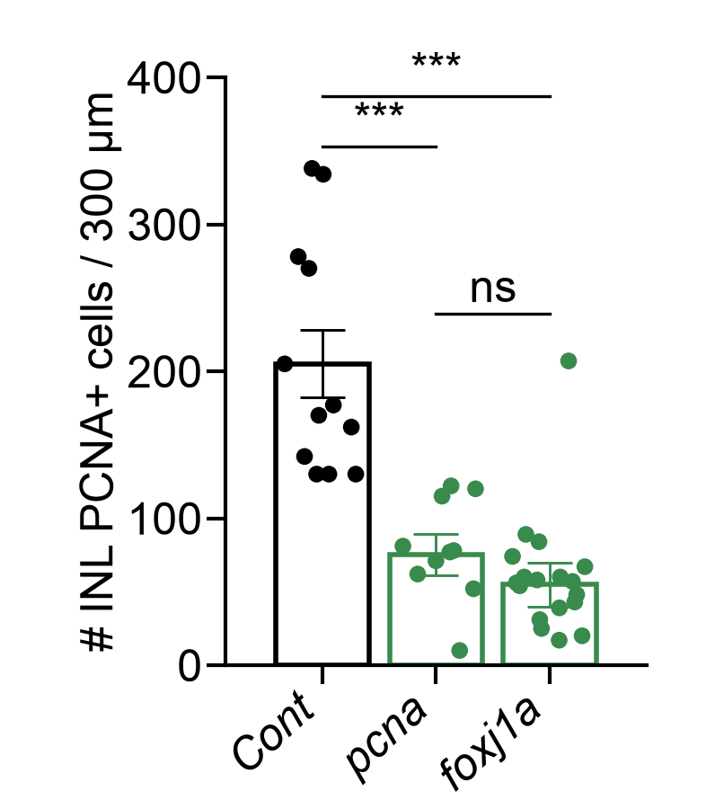
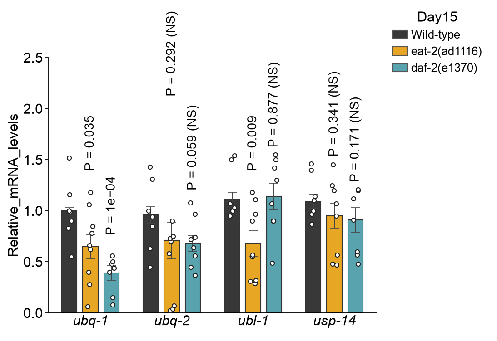
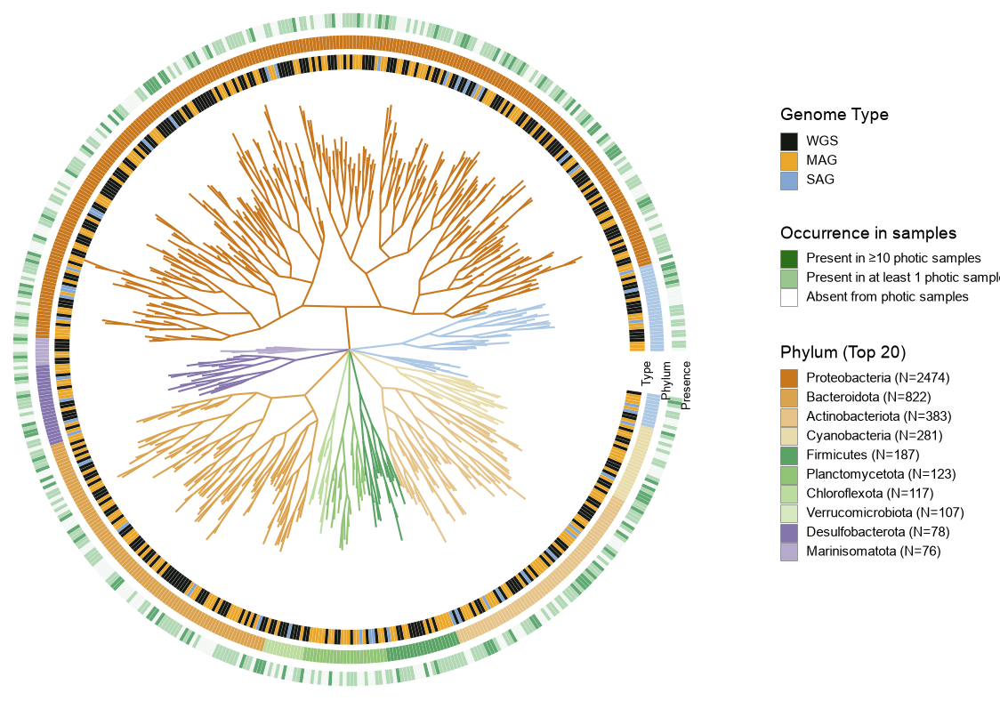
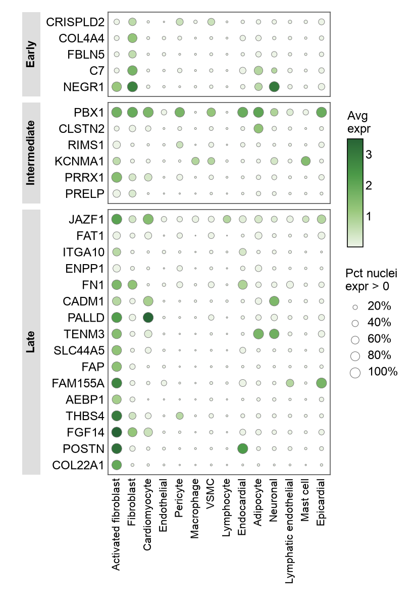
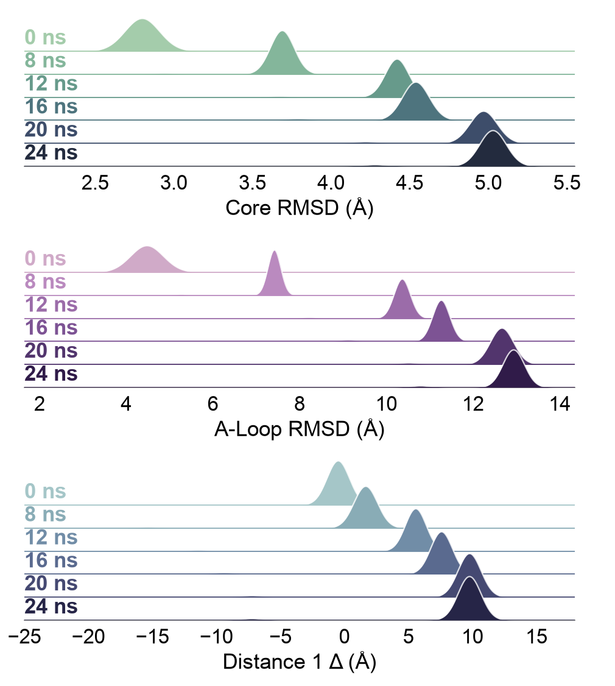
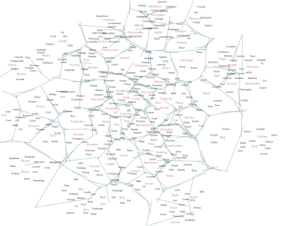
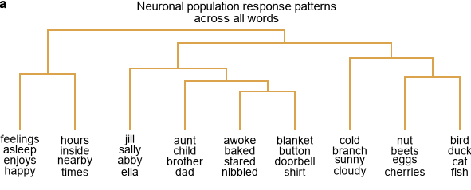
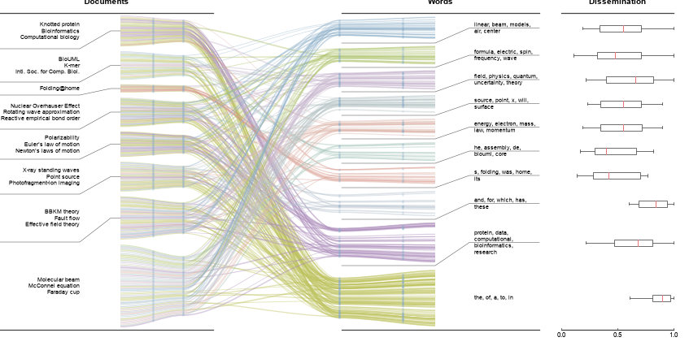

# Figure gallery

[中文](GALLERY.md) | [English](GALLERY.en.md)

## 01 · Outlined bars with sample points

[Code / data / documentation](../figures/figure01/README.en.md)

Manual estimates of visible counts, bar heights and error bars. Occluded samples are not recoverable.

Source-study context (these biological inputs are not required to reuse the chart):

- Sample/animal ID, treatment group and PCNA+ cell count for each replicate.
- Counting region/length, normalization to 300 μm, replicate unit and exclusion rules.
- Original comparison method, error-bar definition and multiple-testing settings.

## 02 · PCoA with marginal boxplots

[Code / data / documentation](../figures/figure02/README.en.md)

Approximate coordinates extracted from colored connected components. Overlapping points are lost; ellipses were visually estimated.

Source-study context (these biological inputs are not required to reuse the chart):

- A sample-feature/abundance matrix or sample distance matrix, plus sample-to-group metadata.
- Distance metric, transformations, PCoA method, axis 1/2 coordinates and explained variation.
- PERMANOVA model, permutation count and strata, plus the ellipse convention.

## 03 · Multi-cohort PCoA composite

[Code / data / documentation](../figures/figure03/README.en.md)

Approximate coordinates extracted from screenshot colors. Some study assignments and control/IBD marker assignments are heuristic.

Source-study context (these biological inputs are not required to reuse the chart):

- Feature tables or a harmonized distance matrix; study, control/IBD group and ID per sample.
- Cross-cohort normalization/batch handling, PCoA coordinates and explained variation.
- Original PERMANOVA design including study effects, covariates and permutation restrictions.

## 04 · Time course with iAUC insets

[Code / data / documentation](../figures/figure04/README.en.md)

Time-course means and errors were visually estimated. Inset observations are seeded synthetic examples.

Source-study context (these biological inputs are not required to reuse the chart):

- Weight, baseline weight, treatment and subject ID for each animal/day, preserving longitudinal pairing.
- Weight-change formula, Exposure/Cessation windows, and the iAUC integration and baseline definitions.
- Individual iAUC values, group means, the specified SD/SEM/CI and original statistical tests.

## 05 · Half-violin raincloud plot

[Code / data / documentation](../figures/figure05/README.en.md)

Synthetic observations sampled from a distribution estimated from screenshot color occupancy. Counts and boxplot statistics are not original.

Source-study context (these biological inputs are not required to reuse the chart):

- Unique genome ID, species/group and BGC count per genome.
- Genome inclusion criteria, BGC-calling method/version and the independent observation unit.
- KDE bandwidth, boxplot whisker convention and outlier policy.

## 06 · Broken-axis grouped bars

[Code / data / documentation](../figures/figure06/README.en.md)

Manual estimates of visible values, means and errors, including the discontinuous y-axis.

Source-study context (these biological inputs are not required to reuse the chart):

- Independent sample IDs and PR1a expression measurements for each genotype under Control/SA.
- Expression normalization and reference gene; for qPCR, preserve target/reference Ct and calibrator samples.
- Original error definition, statistical test and appropriate lower/upper broken-axis ranges.

## 07 · Gene-expression grouped bars

[Code / data / documentation](../figures/figure07/README.en.md)

Manual estimates of visible gene-expression values, means and errors.

Source-study context (these biological inputs are not required to reuse the chart):

- mRNA measurement and biological replicate ID for each gene/genotype at Day15.
- Raw Ct/expression, reference controls and normalization; preserve technical-to-biological replicate mapping.
- Group comparisons, multiplicity correction and error definition; a screenshot cannot recover the P-value calculation.

## 08 · PARP1 variant grouped bars

[Code / data / documentation](../figures/figure08/README.en.md)

Manual estimates of means and errors; example points are constructed from those summaries, not measured replicates.

Source-study context (these biological inputs are not required to reuse the chart):

- GFP measurements and biological replicate IDs for each PARP1 variant and drug condition.
- Background subtraction, −DOX/DMSO controls, fold-change normalization and pairing rules.
- Actual replicate values, summary-error definition and test results; mean ± error is not a substitute for replicates.

## 09 · Dual-axis nested bars

[Code / data / documentation](../figures/figure09/README.en.md)

Manual estimates of two sets of summaries. The three reference-view points are mean ± error and mean, not observed replicates.

Source-study context (these biological inputs are not required to reuse the chart):

- Indigoidine OD600 and Daptomycin concentration (μg/ml) for each strain/construct and independent replicate.
- Assay, calibration curve, dilution factors and pairing between the two measurements.
- Both sets of group means and error definitions, and the actual source of the 0.72/115 reference levels.

## 10 · Radial phylogeny with annotation rings

[Code / data / documentation](../figures/figure10/README.en.md)

Synthetic topology, branch lengths and leaf metadata. No original phylogenetic relationships are available.

Source-study context (these biological inputs are not required to reuse the chart):

- Original Newick/Nexus phylogeny with actual topology, branch lengths, rooting and unique tip IDs.
- Phylum, WGS/MAG/SAG category and sample occurrence for each tip.
- Occurrence thresholds and sample scope, tip ordering and legend counts.

## 11 · Circular phylogeny with heatmap rings

[Code / data / documentation](../figures/figure11/README.en.md)

Synthetic topology, branch lengths and heatmap annotations. No original phylogenetic relationships are available.

Source-study context (these biological inputs are not required to reuse the chart):

- Original phylogeny with branch lengths, rooting, tip IDs and genus/phylum classifications.
- Numerator/denominator and resulting BBAA detection fraction per tip, plus bsh presence/absence.
- BBAA/bsh assay methods and thresholds, genus-sector boundaries and color-scale limits.

## 12 · Grouped gene-expression dot plot

[Code / data / documentation](../figures/figure12/README.en.md)

Bubble radii and colors were estimated on the screenshot grid, not recovered from an expression matrix.

Source-study context (these biological inputs are not required to reuse the chart):

- Gene-by-cell/nucleus expression matrix, cell-type annotations and Early/Intermediate/Late gene groups.
- Normalization/log/scaling method, expression-positive threshold, per-group denominator and missing-value handling.
- Compute mean expression and percent positive for each gene × cell_type; the renderer accepts these summaries.

## 13 · Log-log scatter with marginal histograms

[Code / data / documentation](../figures/figure13/README.en.md)

Seeded synthetic correlated observations. Group counts follow screenshot labels, not recovered study samples.

Source-study context (these biological inputs are not required to reuse the chart):

- Genome ID, SAG/MAG/WGS group, genome length in bp and CDS count for every record.
- Uncorrected measurements, the exact correction method and quality filters.
- Actual sample counts, regression method, residual scale and design for residual group comparisons.

## 14 · Molecular-dynamics ridgelines

[Code / data / documentation](../figures/figure14/README.en.md)

Gaussian mixtures fitted approximately by eye to screenshot peak positions, widths and heights; not trajectory samples.

Source-study context (these biological inputs are not required to reuse the chart):

- Frame/time/replicate IDs and per-frame Core RMSD, A-loop RMSD and Distance 1 Δ values.
- Reference structure, atom selection, alignment procedure, distance definition and Å units.
- Time windows and sampling scheme for the 0/8/12/16/20/24 ns groups; correlated frames are not independent replicates.

## 15 · Flow-cytometry ridgeline matrix

[Code / data / documentation](../figures/figure15/README.en.md)

Gaussian-mixture demonstration curves approximating visible modes; not FCS events.

Source-study context (these biological inputs are not required to reuse the chart):

- Original FCS files or per-event marker intensities, sample IDs, cell populations and −/+ stimulation condition.
- Compensation matrix, gating hierarchy, live-cell/doublet filters and marker-to-channel mapping.
- Log/logicle/arcsinh transformation and parameters, negative controls and density normalization.

## 16 · Cell-population expression ridgelines

[Code / data / documentation](../figures/figure16/README.en.md)

Gaussian-mixture demonstration curves approximating visible modes; not original cell measurements.

Source-study context (these biological inputs are not required to reuse the chart):

- Per-cell/event CD161, NKG2A, CD31, CD8, CD57 and CD28 expression, with sample IDs and c1–c8 labels.
- Vγ9Vδ2/Vδ1 definitions, preprocessing transformation, gating/clustering and composition of All cells.
- Sample weights and the median convention; peak height does not identify the number of cells.

## 17 · Regional age-distribution rainclouds

[Code / data / documentation](../figures/figure17/README.en.md)

Distribution outlines and box summaries were estimated from the screenshot; rug marks are seeded synthetic examples.

Source-study context (these biological inputs are not required to reuse the chart):

- Dated sample ID, region and age in kyr BP; retain age uncertainty or calibrated probability distributions.
- BP reference year, calibration, weights, distribution-aggregation method and KDE bandwidth.
- Five-number summaries and rug locations/weights from the same observations; update all three plotting tables together.

## 18 · Evolutionary-age faceted boxplots

[Code / data / documentation](../figures/figure18/README.en.md)

Five-number summaries estimated by eye; displayed P values are unverified reference annotations.

Source-study context (these biological inputs are not required to reuse the chart):

- Paralog-pair IDs, dN and dS or dN/dS, gene age and Reference/diapause assignment.
- Alignment/substitution-rate estimation and filtering, dS=0 handling and age-bin definitions.
- Box summaries computed from actual observations, whisker convention, comparison tests and adjusted P values.

## 19 · Correlation, expression and proximity composite

[Code / data / documentation](../figures/figure19/README.en.md)

Correlations and KS bars were estimated manually; expression bubbles were estimated from the screenshot grid. No original cell-level data were recovered.

Source-study context (these biological inputs are not required to reuse the chart):

- Single-cell expression, cell types, WT/KO conditions, sample IDs and spatial coordinates or proximity measurements.
- TGFβRII signature, P14 CD8 T-cell reference population, proximity/distance definition and correlation method.
- Per-cell-type WT/KO correlations, gene mean expression/positive fractions, two-sample KS values and the Further/Closer/Similar rule.

## 20 · Word map with partition mesh

[Code / data / documentation](../figures/figure20/README.en.md)

427 word/phrase labels were compiled from readable portions of the low-resolution image; wording and placement are approximate, not a verbatim recovery. Colored boundaries were detected and consolidated into vector segments. Original semantic vectors, distances and true partitions were not recovered.

Source-study context (these biological inputs are not required to reuse the chart):

- Words or phrases, unique IDs, 2D positions, categories and emphasis.
- For semantic interpretation, generate coordinates with your own embeddings/projection and record the method. For layout reuse alone, replace labels while retaining display positions.
- Optional partition mesh must use the same coordinate system; example boundaries are not semantic partitions for a new corpus.

## 21 · Word-group dendrogram

[Code / data / documentation](../figures/figure21/README.en.md)

Nine visible stacks containing 36 words were transcribed; eight merges and their heights were estimated from the image. Heights are display estimates, not distances computed from original neural responses or word vectors.

Source-study context (these biological inputs are not required to reuse the chart):

- Leaf IDs, displayed word stacks and left-to-right order.
- A complete binary hierarchy: merge node ID, child IDs and height for each merge. Inputs may come from text clustering, topic hierarchies or other domains.
- For substantive clustering interpretation, record text representation, distance and clustering method; derive the hierarchy from that actual analysis.

## 22 · Document–word flows and distributions

[Code / data / documentation](../figures/figure22/README.en.md)

Document/topic labels are transcribed with possible reading errors; band positions and ten box summaries are visual estimates. The 300 association curves are simulated with seed 202622, not recovered links or text-analysis results. Blue squares mark path-routing positions and are not additional observations.

Source-study context (these biological inputs are not required to reuse the chart):

- Document/document-group IDs and short labels; topic, keyword or word-group IDs, labels and colors.
- Document-to-topic association rows, such as co-occurrence counts, TF-IDF, topic weights or coded strengths, with a documented definition.
- Optionally, a defined per-topic metric distribution or ordered five-number summary. The source meaning of Dissemination is unverified; replace it with a defined coverage or other metric.
