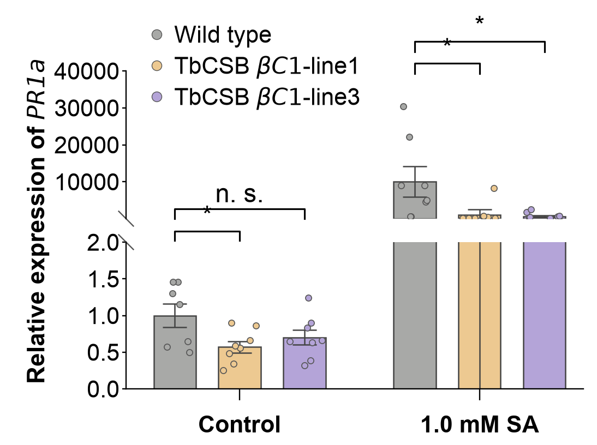

# 06 · Broken-axis grouped bars

[中文](README.md) | **English**

[← Gallery index](../../README.en.md)



## Data provenance

**screenshot_estimate** — Manual estimates of visible values, means and errors, including the discontinuous y-axis.

Original experimental data were not supplied, and a paper/DOI has not been verified. These values demonstrate a reusable chart layout; they are not original research measurements or a pixel-identical reproduction.

## General data requirements

**These templates are not limited to bioinformatics data.** Business, engineering, education, survey and other datasets can be used when they match the target CSV column names, types, table structure and numeric constraints. Biological names and units in the field tables describe the current examples; map their meanings to your own metrics while retaining the column names expected by the code.

Start with “Files and columns”, prepare matching inputs, and update categories, labels, units and axis limits in `style.json`. Adjust fixed layouts in `plot.py` when group or panel counts change. The original-data and preprocessing notes below explain the source study context; reusing the chart does not require those biological raw data or analyses. Mathematical constraints still apply, such as positive values on log axes, nonnegative errors and acyclic trees.

## Source-study context: original data

- Independent sample IDs and PR1a expression measurements for each genotype under Control/SA.
- Expression normalization and reference gene; for qPCR, preserve target/reference Ct and calibrator samples.
- Original error definition, statistical test and appropriate lower/upper broken-axis ranges.

## Source-study context: preprocessing example

Normalize expression upstream and fill the long table. Changing value triggers mean/SEM recalculation by default. Check both y-axis ranges for new values.

## Files and columns

`plot.py` contains the actual drawing code; `style.json` controls canvas, labels, colors and ordering; `data/` holds replaceable CSVs. `provenance.json` records per-file provenance, row count, SHA-256, columns and units.

### [figure06.csv](data/figure06.csv)

`screenshot_estimate` · 47 rows. Missing/NaN/Inf numeric values are unsupported; use UTF-8.

| Column | Type | Unit | Meaning |
|---|---|---|---|
| `category` | string | label | Category/condition; match style ordering |
| `group` | string | label | Experimental group or cell population; match style |
| `sample` | string | identifier | Example replicate ID; preserve real sample IDs when available |
| `value` | number | normalized expression / fold change | One observation; units/normalization are specified in this figure’s raw-data requirements |
| `mean` | number | normalized expression / fold change | Group mean; repeat the same summary within each group |
| `error` | number ≥ 0 | normalized expression / fold change | Error magnitude; explicitly specify SD/SEM/CI |

```csv
category,group,sample,value,mean,error
Control,Wild type,1,0.5,1,0.16
Control,Wild type,2,0.57,1,0.16
```

## Run and replace data

```bash
python -m figures.figure06.plot --format png svg
cp -R figures/figure06/data my_data
# Edit the relevant CSVs in my_data, then run:
python render.py --figure 6 --data-dir my_data --out my_output --format png svg pdf
```

Run commands from the repository root. Changing groups, genes, panel counts, sample-count labels or units also requires updating style.json and, where necessary, plot.py layout. A fixed canvas does not adapt to arbitrary group counts. Original statistical annotations are disabled by default when CSVs change. See the [main README](../../README.en.md) for summary modes.
