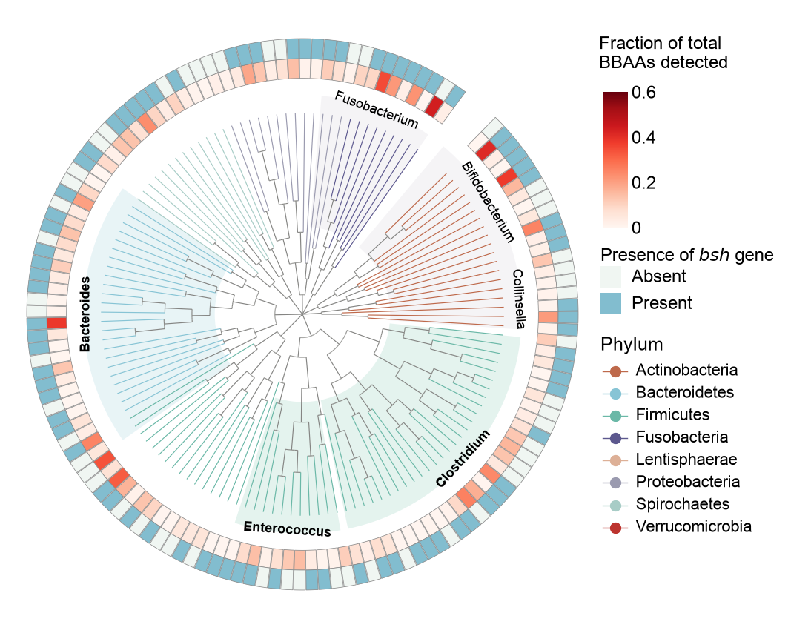

# 11 · Circular phylogeny with heatmap rings

[中文](README.md) | **English**

[← Gallery index](../../README.en.md)



## Data provenance

**synthetic** — Synthetic topology, branch lengths and heatmap annotations. No original phylogenetic relationships are available.

Original experimental data were not supplied, and a paper/DOI has not been verified. These values demonstrate a reusable chart layout; they are not original research measurements or a pixel-identical reproduction.

## General data requirements

**These templates are not limited to bioinformatics data.** Business, engineering, education, survey and other datasets can be used when they match the target CSV column names, types, table structure and numeric constraints. Biological names and units in the field tables describe the current examples; map their meanings to your own metrics while retaining the column names expected by the code.

Start with “Files and columns”, prepare matching inputs, and update categories, labels, units and axis limits in `style.json`. Adjust fixed layouts in `plot.py` when group or panel counts change. The original-data and preprocessing notes below explain the source study context; reusing the chart does not require those biological raw data or analyses. Mathematical constraints still apply, such as positive values on log axes, nonnegative errors and acyclic trees.

## Source-study context: original data

- Original phylogeny with branch lengths, rooting, tip IDs and genus/phylum classifications.
- Numerator/denominator and resulting BBAA detection fraction per tip, plus bsh presence/absence.
- BBAA/bsh assay methods and thresholds, genus-sector boundaries and color-scale limits.

## Source-study context: preprocessing example

Convert the tree to edges and join annotations. This circular layout aligns terminal nodes to a fixed radius, so displayed terminal lengths are not original branch lengths. Update genus_labels for a replacement tree.

## Files and columns

`plot.py` contains the actual drawing code; `style.json` controls canvas, labels, colors and ordering; `data/` holds replaceable CSVs. `provenance.json` records per-file provenance, row count, SHA-256, columns and units.

### [figure11.csv](data/figure11.csv)

`synthetic` · 258 rows. Missing/NaN/Inf numeric values are unsupported; use UTF-8.

| Column | Type | Unit | Meaning |
|---|---|---|---|
| `node` | string | identifier | Unique node ID; root is reserved |
| `parent` | string | identifier | Parent ID or implicit root named root |
| `length` | number ≥ 0 | tree-specific | Branch length from parent; state its unit |
| `phylum` | string | taxonomy | Phylum label matching style.phyla |

```csv
node,parent,length,phylum
n0,root,0.11828764720890793,Fusobacteria
n1,n0,0.17776591392450247,Fusobacteria
```

### [figure11_leaves.csv](data/figure11_leaves.csv)

`synthetic` · 133 rows. Missing/NaN/Inf numeric values are unsupported; use UTF-8.

| Column | Type | Unit | Meaning |
|---|---|---|---|
| `node` | string | identifier | Unique node ID; root is reserved |
| `order` | unique number | ordering | Unique tip order around the circle |
| `phylum` | string | taxonomy | Phylum label matching style.phyla |
| `type` | WGS / MAG / SAG | category | Genome category; used by figure 10 |
| `presence` | 0 / 1 / 2 | category | Figure 10 occurrence: absent / at least 1 / at least 10 samples |
| `fraction` | number [0, 1] | fraction | Figure 11 detected fraction; default displayed range 0–0.6 |
| `bsh` | 0 / 1 | boolean | Figure 11 bsh absence/presence |

```csv
node,order,phylum,type,presence,fraction,bsh
n2,0,Fusobacteria,MAG,1,0.028,1
n4,1,Fusobacteria,WGS,2,0.4377,0
```

## Run and replace data

```bash
python -m figures.figure11.plot --format png svg
cp -R figures/figure11/data my_data
# Edit the relevant CSVs in my_data, then run:
python render.py --figure 11 --data-dir my_data --out my_output --format png svg pdf
```

Run commands from the repository root. Changing groups, genes, panel counts, sample-count labels or units also requires updating style.json and, where necessary, plot.py layout. A fixed canvas does not adapt to arbitrary group counts. Original statistical annotations are disabled by default when CSVs change. See the [main README](../../README.en.md) for summary modes.
