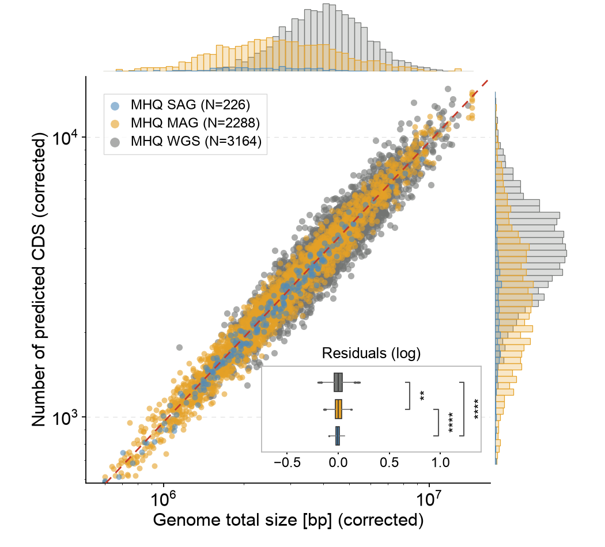

# 13 · Log-log scatter with marginal histograms

[中文](README.md) | **English**

[← Gallery index](../../README.en.md)



## Data provenance

**synthetic** — Seeded synthetic correlated observations. Group counts follow screenshot labels, not recovered study samples.

Original experimental data were not supplied, and a paper/DOI has not been verified. These values demonstrate a reusable chart layout; they are not original research measurements or a pixel-identical reproduction.

## General data requirements

**These templates are not limited to bioinformatics data.** Business, engineering, education, survey and other datasets can be used when they match the target CSV column names, types, table structure and numeric constraints. Biological names and units in the field tables describe the current examples; map their meanings to your own metrics while retaining the column names expected by the code.

Start with “Files and columns”, prepare matching inputs, and update categories, labels, units and axis limits in `style.json`. Adjust fixed layouts in `plot.py` when group or panel counts change. The original-data and preprocessing notes below explain the source study context; reusing the chart does not require those biological raw data or analyses. Mathematical constraints still apply, such as positive values on log axes, nonnegative errors and acyclic trees.

## Source-study context: original data

- Genome ID, SAG/MAG/WGS group, genome length in bp and CDS count for every record.
- Uncorrected measurements, the exact correction method and quality filters.
- Actual sample counts, regression method, residual scale and design for residual group comparisons.

## Source-study context: preprocessing example

Apply the correction upstream and supply strictly positive values. The code fits a line and computes residuals in log10 space; it does not run significance tests between residual groups.

## Files and columns

`plot.py` contains the actual drawing code; `style.json` controls canvas, labels, colors and ordering; `data/` holds replaceable CSVs. `provenance.json` records per-file provenance, row count, SHA-256, columns and units.

### [figure13.csv](data/figure13.csv)

`synthetic` · 5678 rows. Missing/NaN/Inf numeric values are unsupported; use UTF-8.

| Column | Type | Unit | Meaning |
|---|---|---|---|
| `group` | string | label | Experimental group or cell population; match style |
| `genome_bp` | number > 0 | bp | Genome length corrected by the original method |
| `cds` | number > 0 | count | Corrected predicted CDS count |

```csv
group,genome_bp,cds
MHQ SAG (N=226),1312058.88,1175.16
MHQ SAG (N=226),3615231.72,3191.64
```

## Run and replace data

```bash
python -m figures.figure13.plot --format png svg
cp -R figures/figure13/data my_data
# Edit the relevant CSVs in my_data, then run:
python render.py --figure 13 --data-dir my_data --out my_output --format png svg pdf
```

Run commands from the repository root. Changing groups, genes, panel counts, sample-count labels or units also requires updating style.json and, where necessary, plot.py layout. A fixed canvas does not adapt to arbitrary group counts. Original statistical annotations are disabled by default when CSVs change. See the [main README](../../README.en.md) for summary modes.
