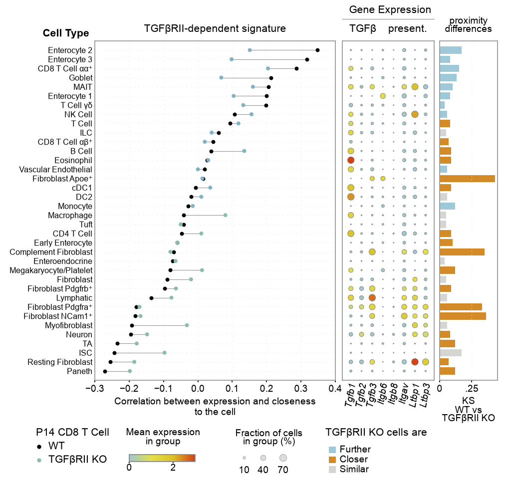

# 19 · 相关性 哑铃 气泡 与条形组合图

**中文** | [English](README.en.md)

[← 返回总目录](../../README.md)



## 数据来源

**screenshot_estimate_and_digitized** — 相关系数和条形人工估读，气泡按截图网格估读；非原始统计结果

原始实验数据未提供；论文/DOI 尚未核实。这里的值仅用于图式复用，不是原始研究数据，也不构成像素完全一致的复现。

## 通用数据要求

**这些模板不限于生信数据。** 商业、工程、教育、社会调查等领域的数据，只要符合目标图的 CSV 字段名、类型、表结构和数值约束，就可以复用。字段表里的生物学名称与单位描述的是当前示例，可映射为自己的指标含义；CSV 列名仍需保留代码要求的名称。

优先阅读“文件与字段”，按格式整理数据，并同步修改 `style.json` 中的分类、标签、单位和坐标范围；分组或面板数量变化时，按需调整 `plot.py` 的固定布局。下文原始数据与预处理说明仅用于理解原图研究背景，复用图式不要求具备这些生信原始数据，也不要求执行对应生信分析。各图的数学约束仍然适用，例如对数轴取值必须为正、误差非负、树结构不能有环。

## 原图研究背景：原始数据

- 单细胞表达矩阵、细胞类型、WT/KO 条件、样本 ID，以及细胞空间坐标或邻近度量。
- TGFβRII signature、P14 CD8 T cell 参考群、邻近/距离定义与相关方法。
- 每种细胞类型的 WT/KO 相关系数、指定基因的平均表达/阳性率、两样本 KS 值及 Further/Closer/Similar 判定规则。

## 原图研究背景：预处理示例

相关系数、表达汇总、KS 和邻近类别均需在原分析流程中计算。绘图脚本不从表达和坐标重新推断这些统计量。

## 文件与字段

`plot.py` 是本图实际绘图代码；`style.json` 控制画布、标签、颜色和分类顺序；`data/` 保存可替换 CSV。`provenance.json` 逐文件记录来源类别、行数、SHA-256、字段含义与单位。

### [figure19.csv](data/figure19.csv)

`screenshot_estimate_and_digitized` · 36 行。空值/NaN/Inf 不受支持；字段使用 UTF-8。

| 字段 | 类型 | 单位 | 含义 |
|---|---|---|---|
| `cell_type` | string | label | 细胞类型；与样式顺序一致 |
| `wt` | number [-1, 1] | correlation | WT 条件下的指定相关系数 |
| `ko` | number [-1, 1] | correlation | KO 条件下的指定相关系数 |
| `ks` | number [0, 1] | statistic | 已计算的两样本 KS 统计量 |
| `relation` | Further / Closer / Similar | category | 按原分析判定的邻近类别 |

```csv
cell_type,wt,ko,ks,relation
Enterocyte 2,0.347,0.151,0.17,Further
Enterocyte 3,0.317,0.098,0.08,Further
```

### [figure19_expression.csv](data/figure19_expression.csv)

`screenshot_estimate_and_digitized` · 288 行。空值/NaN/Inf 不受支持；字段使用 UTF-8。

| 字段 | 类型 | 单位 | 含义 |
|---|---|---|---|
| `cell_type` | string | label | 细胞类型；与样式顺序一致 |
| `gene` | string | identifier | 基因名称；与样式中的基因顺序一致 |
| `expression` | number | normalized expression | 指定归一化方式下的平均表达；非原始计数 |
| `percent` | number [0, 100] | percent | 阳性细胞百分比；控制气泡面积 |

```csv
cell_type,gene,expression,percent
Enterocyte 2,Tgfb1,0.03,3.1
Enterocyte 2,Tgfb2,0.03,3.1
```

## 运行与替换数据

```bash
python -m figures.figure19.plot --format png svg
cp -R figures/figure19/data my_data
# 修改 my_data 内所有对应 CSV，再运行：
python render.py --figure 19 --data-dir my_data --out my_output --format png svg pdf
```

命令均从仓库根目录执行。修改组名、基因名、面板数、样本量标签或量纲时，也要修改 `style.json` 与必要的 `plot.py` 布局；固定画布不会自动容纳任意数量的分组。示例原图统计标注在 CSV 改动后默认停用。完整统计模式说明见[总 README](../../README.md)。
