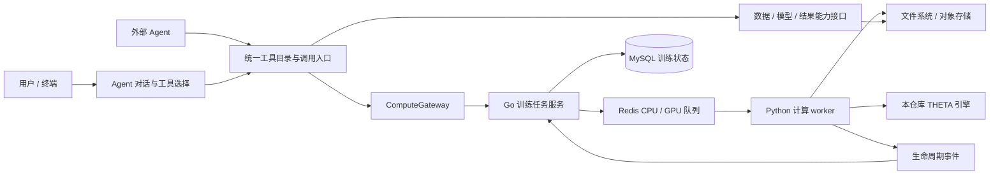

# Agent 迁移设计：以计算平台为基线重建 main

日期：2026-09-05。状态：`agent-dev` 已迁入独立对话、CLI、多供应商、会话、数据画像、方案确认、本地训练与结果证据能力。根目录 `src/` 和 `trainning/` 本次未修改，Web 暂不迁入。启动与当前限制以 [Agent README](../../agent/README.md) 为准。

实施调整：为了单独启动本地产品，新增 `ComputeGateway` 的单机适配，使用独立后台进程和 SQLite 单次领取，直接复用现有 `trainning/worker` 协议与管线。远端模式才由 Go 作为任务事实来源，两种模式不共同调度同一任务。它替代了原设计“本地也必须先部署 Go/MySQL/Redis”的前置条件；并不复制引擎或声称提供分布式可靠性。完整远端数据/结果接口和 GPU 验证仍为后续工作。

下文保留迁移设计与后续扩容要求，其中服务端接口扩展尚未实施；CLI 功能已按独立目录迁入，旧 Hypha 推理依赖抽为兼容端口，数据与结果纯模块已复用。

协作分支：`main` 为稳定基线，`dev` 从当前 main 创建，用于集成各成员的代码；`agent-dev` 从同一 main 基线创建，用于完整 Agent 开发。集成方向为功能分支 → `dev` → `main`。已有的旧 dev 分别保留为 `legacy-dev-20260905`（远端版本）和 `legacy-dev-local-20260905`（本地版本）。

本轮范围调整：`theta.code-soul.com/` 暂不迁入，不作为 Agent 交付前置条件。CLI 界面及专用交互代码统一放在独立的 `agent/cli/`，不放入任何 `src/` 目录。

## 1. 分支与代码归属

| 角色 | 分支 / 提交 | 说明 |
| --- | --- | --- |
| 新 main 的计算基线 | `training_backfront` / `93577ee068c8960a6382993a3c2c168b23d361f1` | 保留根目录 THETA 引擎、Go 控制面和 Python worker；main 在此基础上继续提交 |
| 原 main 的已提交版本 | `65783a6453cb839d13d585c13cdf3bd5c82dfbcb` | 原有 Web、Agent API、Python bridge 与内嵌 THETA 快照 |
| 旧 Agent 完整保留分支 | `legacy-agent-20260905` / `ae37a1abe809b85fa3657081f5f20da8aa4f3eb4` | 包含原 main，以及本轮完成的独立 CLI、终端界面、对话循环和多供应商适配 |

新 main 与旧 main 没有共同祖先，因此采用“保留旧分支、从计算分支重建 main、按模块迁移”的方式，不合并两套无关历史。`training_backfront` 保持原样；误提交的 `trainning/.venv-worker/` 虚拟环境仅从新 main 移除。

核查发现，原来的 `theta_project/THETA/` 实际是纳入 Git 的源码快照，并非 submodule。问题是它与根目录计算分支形成了两个源码入口，且旧 bridge、Docker 和启动脚本依赖嵌套路径。真正需要外部版本锁定的是 Hypha 框架依赖。迁移后，THETA 引擎只能有一个源码入口：本仓库 `src/models/`。

当前本地旧版工作树保留在 `.local/legacy-agent/`，旧依赖、环境文件和运行目录也一起保留在其中。可进入该目录使用原来的 `./theta` 启动入口；历史记录中存储的绝对路径需要在迁移时校验。密钥与本地状态不进入 Git。稳定 main 尚未合入此次迁移；`agent-dev` 已提供根目录 `./theta` 与 Agent 包内 `pnpm start`。

## 2. 产品与模块边界

产品入口是一段持续的对话。用户可以描述研究问题、询问模型区别、提供数据、修改目标、查看进度、取消训练或解释已有结果。Agent 按当前意图、已有证据和工具结果决定下一步；缺信息时提问，有足够信息时执行。训练任务自身有严格状态机，但整个对话不被固定的训练步骤锁住。

目标目录（Agent 核心和 CLI 已迁入；contracts 与服务端扩展后续独立实施）：

```text
agent/                         # TypeScript Agent 产品
  cli/                         # 独立 CLI 应用目录，不在 src 内
    bin/                       # 启动入口与命令行解析
    shell/                     # 交互输入、斜杠命令、会话选择
    ui/                        # 终端渲染、布局、进度、确认卡片
    commands/                  # 非交互 tools list/call 等 CLI 适配
    # CLI 测试与 shell/ui 实现相邻，不放入 src
  src/conversation/            # 模型工具调用循环、上下文和中断恢复
  src/domain/                  # 研究目标、方案、确认凭据、结果证据
  src/tools/                   # 工具 schema、校验和调用授权
  src/providers/               # 多供应商推理适配
  src/memory/                  # 会话与研究记录，独立于训练任务状态
  src/adapters/                # ComputeGateway、数据与产物接口适配
contracts/                     # 新增：版本化 JSON Schema、兼容性样例
src/models/                    # 已有：唯一的 THETA 算法实现
config/、scripts/              # 已有：引擎配置与运行脚本
trainning/                     # 已有：暂保留上游拼写，避免混入路径重构
  cmd/controlplane/            # Go 任务服务入口
  internal/                   # MySQL 状态、任务校验、Redis 消息
  worker/                     # Python 计算执行与产物上传
```

依赖方向为 `agent/cli/ → agent/src/ → contracts/`。核心通过结构化事件报告文本、工具调用、进度和确认请求，由 CLI 渲染；核心不依赖终端组件、stdin/stdout、TTY 或斜杠命令。会话持久化、工具 schema、供应商配置和推理循环属于可复用核心，CLI 只拥有它们的交互入口。根目录 `src/models/` 继续仅承载 THETA 引擎。



| 模块 | 拥有的职责 | 不应拥有的职责 |
| --- | --- | --- |
| Agent | 意图理解、研究讨论、工具选择、用户确认、结果解读、会话恢复 | 训练进程管理、Redis 租约、第二套训练状态数据库 |
| Go 控制面 | 训练请求校验、任务和 attempt、调度、取消、状态归并、授权检查 | LLM 对话策略、训练算法 |
| Python worker | 数据准备、模型加载、训练、评估、受控子进程、产物生成 | 直接写 MySQL、决定用户研究意图、接受模型任意 shell 命令 |
| THETA 引擎 | 算法与可重复实验逻辑 | Agent 会话、用户账户、队列协议 |
| 存储适配 | 数据与产物引用、校验、上传下载 | 将机器绝对路径作为跨服务协议 |

现有 worker 把数据准备、训练和评估组合在一次执行中。第一阶段保留这条可运行路径；后续增加可独立部署的数据画像、embedding 和结果读取能力。模块拆分不等于立即拆成很多服务，本地可以共用进程；上云时以同一份 schema 和对象引用跨进程调用。

## 3. 复用什么，替换什么

以下源路径均相对于 `legacy-agent-20260905`。

| 旧模块 | 迁移方式 | 必须处理的耦合 |
| --- | --- | --- |
| 旧 `src/product/agent-shell.ts`、`terminal-view.ts`、`tools-cli.ts` 及入口 | 分别迁入 `agent/cli/shell/`、`ui/`、`commands/` 与 `bin/`；相关交互测试进 `cli/tests/` | CLI 专用代码不得留在 `src/`，不直接调度计算进程 |
| 旧 `src/product/conversation-agent.ts`、`session-store.ts`、`tool-catalog.ts`、`local-tools.ts` | 分别迁入 `agent/src/conversation/`、`memory/`、`tools/` 与适配层 | 移除旧 application service 硬依赖；核心不导入 CLI，工具目录与机器调用格式共享 |
| `src/providers/` 与环境配置加载 | 保留 DeepSeek / OpenAI / MiniMax / GLM 适配和工具协议归一化 | 重做仓库路径解析；验证缺少某家密钥不影响其他供应商；不把 Chat Completions 兼容等同于所有原生协议兼容 |
| 会话存储、Hypha 适配与版本锁 | 保留本地 SQLite 会话恢复，重新定位 Hypha 依赖 | 对话记忆归 Agent；训练事实从 Go 查询，不能用旧缓存覆盖 |
| 工具目录及 `tools list/call` | 与内部对话共享 schema、校验、错误格式 | 机器调用返回结构化结果；用户确认属于宿主权限，不能成为 LLM 可自行调用的批准工具 |
| 研究方案、checkpoint、结果证据逻辑 | 拆出可复用的领域对象和规则 | 确认绑定具体数据版本、参数和操作；普通问答不强制创建训练 run |
| `theta_agent_bridge/dataset/` | 提取读取、画像、采样、脱敏能力到独立模块 | 输入输出改为可序列化协议，禁止依赖调用方工作目录 |
| `theta_agent_bridge/results_reader.py` | 迁入结果能力模块，保留受限读取与证据核验 | 使用产物 manifest、对象 key 和 hash；只按任务所属用户授权读取 |
| 旧 bridge `runner.py`、training worker、TS 训练编排 | 以 Go 控制面和现有 Python worker 替代调度职责 | 不整体复制；有价值的取消、验证和进程清理修复逐项移植到新控制面/worker |
| `theta_project/THETA/` | 与根目录引擎做忽略换行差异的逐文件比较 | 仅迁入真实修复，例如数据编码、时间字段、协变量、结果证据；不能覆盖较新的 GPU/产物工具 |
| `theta.code-soul.com/` 与原 Web 部署脚本 | 暂不迁入，继续保留在旧分支 | Agent 不依赖 Next.js、Web 配置或其发布流程；未来接入单独设计 |

## 4. 工具与任务协议

### 现有能力

Go 已有 `POST /api/v1/tasks`、任务查询、取消、修改、删除、模型下载，以及健康检查。它解析模型/runtime、数据归属和参数，生成 `schema_version: 2` 的不可变 `job.ready`。Python worker 消费 CPU/GPU 队列，执行本仓库引擎，通过事件回传状态，控制面写 MySQL。

这套 API 目前主要覆盖训练，尚不能直接满足 Agent 的数据导入/画像、模型发现和结果证据读取。因此不能只把训练 POST 包装成一个“全能工具”。

### 拟新增端口

| Agent 工具族 | 接口职责 | 执行归属 |
| --- | --- | --- |
| `dataset.import / inspect / sample` | 导入、字段质量、语言/时间/文本列画像、有限样本 | 数据服务与 Python 数据能力 |
| `model.list / inspect / prepare` | 区分算法目录、运行时和 embedding 权重；报告已安装/需下载状态 | 模型目录与模型准备 worker |
| `training.propose / submit / status / cancel` | 方案、受确认约束的提交、状态查询与取消 | Agent 领域层 + ComputeGateway + Go |
| `results.list / read / compare` | 有界证据、指标、主题词和产物对比 | 结果能力模块 |
| 会话与研究记录工具 | 恢复目标、记录结论、关联数据和多次实验 | Agent 记忆层 |

`ComputeGateway` 是 Agent 唯一的训练提交端口。适配器处理 HTTP、错误和重试，LLM 不接触 Redis，也不拼训练 shell。会话可以关联多个研究 run，每个 run 可以关联多个 Go task；训练 attempt 属于 Go。映射持久保存，应用重启后按 task ID 恢复观察，不能自动重新提交。

拟定提交记录至少包含 `schema_version`、`request_id`、`run_id`、数据引用及内容 hash、模型/runtime 版本、规范化参数、资源请求、宿主确认凭据。内部映射使用 Go 的 task ID 和 attempt。`request_id` 由宿主生成并在重试中保持不变；服务端对用户、键和请求内容建立唯一约束，同键同内容返回原任务，同键不同内容拒绝。确认凭据绑定规范化请求摘要；参数或数据变化后重新判断确认，不能复用旧批准。

这些字段是待实现扩展，不是当前 Go API 已支持的请求格式。用户身份由经过验证的宿主身份传入，不允许 LLM 自填 `user_id`；服务端仍须对查询、取消和产物读取检查归属。统一工具结果提供请求 ID、成功/失败、稳定错误码、是否可重试及有限 payload，底层栈和密钥不进入对话。

### 数据与模型

本地文件先由数据入口读取并计算 hash，写入文件存储，再由控制面登记数据引用。云端替换为对象存储上传，训练协议仍只携带对象 key 和 hash。数据登记的唯一事实来源与现有 `theta_datasets` 对齐；不能让 CLI 和 Go 各维护一份互不相认的 dataset ID。

模型下载是一项显式可观察的资源操作：工具先报告大小、来源、可用缓存与目标运行时，执行策略再决定是否需要用户确认。推理供应商模型和 topic/embedding 模型使用不同配置域。DeepSeek 的本地密钥已经保留在旧工作树私有环境文件中；迁移加载器时按需搬迁，不提交密钥，也不把开发机路径写成默认配置。

结果解释必须引用本次 task/attempt 的完整产物 manifest、参数、数据 hash 和引擎版本。失败或未完成的任务不能被解读成成功；主题命名属于解释，不能虚构指标。读取原文样本应有数量上限，并通过同一授权边界。

## 5. 本地运行与云端扩容

第一阶段：终端 Agent 可以单独启动并进行讨论；计算能力未启动时，明确展示不可用状态，并保留会话。训练路径使用本机 Go + MySQL + Redis + Python worker，文件系统对象存储。Agent 不为了启动聊天就要求所有计算依赖在线。

提供统一的开发启动器属于后续实施项：探测依赖、启动需要的服务、显示健康状态；不能在启动时重置已有数据库。`trainning/README.md` 已说明旧 `migrations/001_worker_control.sql` 与现有 UUID 业务 schema 不兼容，迁移必须单独设计并验证，禁止把开发库 reset 脚本当作升级脚本。

上云后：Agent 服务、Go 控制面、数据 worker、CPU/GPU 计算 worker 分别扩容；换 endpoint 与存储适配，保持工具契约。CPU/GPU worker 消费不同队列，计算使用同一引擎构建产物和固定版本。当前资源字段和镜像信息并不自动构成资源调度器；CPU、内存和 GPU 的实际限制需由容器/集群执行器落实。

事件和日志贯穿 request/run/task/attempt/execution ID。Agent 的模型调用取消与训练任务取消分开：用户中断生成不应默认杀掉已提交训练；用户明确取消训练才走任务取消接口。长训练通过状态订阅/轮询反馈，CLI 关闭后任务继续，恢复会话时重新查询。

## 6. 接入前需要补强的计算边界

以下是当前基线的代码核查结果，并非本次已修复的功能：

1. `trainning/worker/service.py` 的续租异常会继续重试，缺少租约到期前的可靠停机边界；应记录最后成功续租时间并在无法证明持有租约时终止子进程。终态提交需以租约 token 校验所有权。
2. 同一文件中终态采用 `publish_event → mark_done → acknowledge` 三步；中途断连存在重复处理窗口。应实现受 token 约束的原子终态写入/确认及幂等消费，不能只依赖 task ID 去重。
3. `worker/pipeline.py` 为同 task/attempt 创建固定目录并先删除旧目录；重领时旧进程可能仍在执行。应增加独立 execution ID、隔离目录和上传前缀，仅接受当前有效执行的 manifest。
4. `worker/redis_queue.py` 的 pending reclaim 每次从 `0-0` 开始，应维护返回游标并验证大量 pending 消息下的公平性。事件裁剪、重放、取消与重领需要真实 Redis 集成测试。
5. `internal/task/service.go` 先创建任务再发布 Redis 消息；标记 dispatch failed 不能消除提交与发布之间崩溃的窗口。应增加事务 outbox 和可恢复发布机制，取消消息同样处理。
6. 对外接入前补齐调用者认证、逐资源授权、提交幂等与确认绑定。产物上传/读取同时校验 hash、路径及符号链接边界；资源限制、参数类型和 GPU 可见性需从控制面贯穿到实际子进程。

修复应落在这一份 `trainning/` 中，避免在 Agent 适配器里重新实现租约、重试调度或进程管理。

## 7. 分阶段实施与验收

| 阶段 | 交付 | 验收门槛 |
| --- | --- | --- |
| M0：基线 | 旧 Agent 保留分支、新 main 基于计算分支、迁移设计 | 远端引用核验；计算源码保留；本地密钥未提交；原 worker 测试 |
| M1：Agent 产品入口 | 迁入对话循环、终端 UI、供应商、SQLite 会话；新增端口并移除旧训练服务硬依赖 | 单独启动；普通问答无需计算服务；工具调用、会话恢复、供应商切换的确定性测试；终端交互检查 |
| M2：数据与模型能力 | 统一数据引用、画像、模型目录和准备能力 | CSV 导入/坏编码/缺列错误；不重复导入；工具 schema 兼容；缺权重如实报告 |
| M3：真实训练 | ComputeGateway 接现有 Go API；补齐幂等、授权、outbox 和 worker 可靠性 | 小型 CPU LDA 完成；重试不重复建任务；进程重启、租约失效、取消与消息重放集成测试 |
| M4：解读与迭代 | 结果 manifest、证据读取、比较、参数调整和再次训练 | 结果均可追溯到具体 attempt；用户改目标不被固定步骤卡住；中断恢复后不丢关联 |
| M5：Agent 打包与部署准备 | CLI 独立启动和打包；本地组合启动与独立 worker 镜像 | CLI 与外部 Agent 工具调用契约一致；数据迁移演练；CPU/GPU 分别验证；云端部署另行执行 |

M1 应首先拆开对话核心与旧 application service，而不是整包 cherry-pick 旧 Agent 提交。每阶段保持可运行入口，按模块移植并保留测试。旧分支在 M5 验收前继续保留；回退时使用该分支或独立工作树，不覆盖新 main 的计算进展。历史 SQLite/运行文件先做副本迁移与路径校验，不直接改写唯一原件。

本次验证：在 `trainning/` 执行 `python3 -m unittest discover -s worker/tests -t .`，18 项通过；`go test ./...` 通过。旧工作树 `./theta --help` 启动入口通过。这些检查不等于真实 Redis/MySQL 集成、完整模型训练或 GPU 验证。

后续迁移验证：已通过真实 CPU LDA fixture 训练、重复提交/恢复查询与 hash 验证结果读取；DeepSeek 实际原生工具调用通过。未执行用户数据训练、数据库迁移或线上部署。云端完整接口与 GPU 扩容仍需独立验收。
