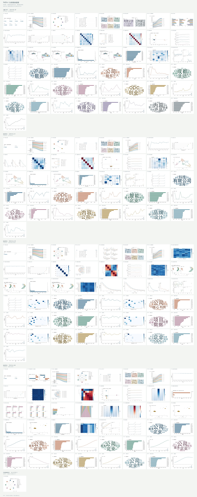
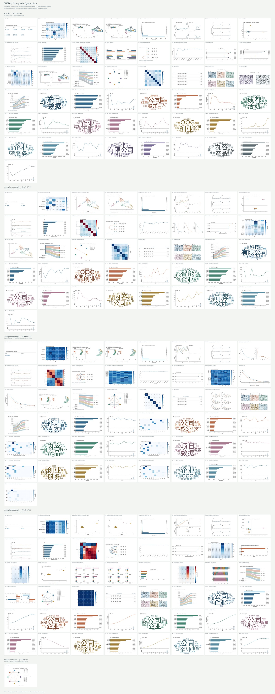

# THETA 中英文组图示例

[English](README.md) · [原生可视化与高清导出说明](../../publication-visualization.md)

使用仓库原生绘图代码，于 2026-09-08 生成的真实 OPC 示例。中英文各 **188 张图**，分别合并为一张 **7680 × 19328 像素**总览。下方是轻量预览，点击完整 PNG 可放大查看；英文图中的中文关键词来自原始语料，保留其原貌。

| 语言 | 完整高清组图 | 六图细节示例 | 图表编号索引 |
| --- | --- | --- | --- |
| 中文 | [PNG](zh/THETA-all-figures-zh.png) | [PNG](zh/detail-example.png) | [CSV](zh/figure-index.csv) |
| English | [PNG](en/THETA-all-figures-en.png) | [PNG](en/detail-example.png) | [CSV](en/figure-index.csv) |

## 数据范围

| 分区 | 数据与模型 | 每种语言图数 |
| --- | --- | ---: |
| 全量 OPC | 32,601 条文档，LDA K=8 | 49 |
| LDA 验收样本 | 1,800 条文档，K=6；另含 K=4/6/8 评估 | 41 |
| DTM 验收样本 | 同一 1,800 条样本，K=6 | 49 |
| STM 验收样本 | 同一 1,800 条样本，K=6 | 48 |
| 可选相关阈值网络 | 全量 OPC，Pearson 相关绝对值 > 0.15 | 1 |

补训样本用于验证绘图功能，不代表全量研究结论或模型优劣。缺少真实证据的图表仍明确省略，不补造数据。历史设计对照和合成渲染测试图未重复收录。索引中的 `source` 是相对于本地 `result/` 的来源记录；本目录不包含对应源文件、原始文本、矩阵或训练权重。完整分页 PDF 与 ZIP 保留在本地，仓库提供两张完整总览 PNG 和各一页细节示例。

## 中文总览

## 英文总览

使用自己的模型结果时，按[原生导出说明](../../publication-visualization.md)运行。安装可视化依赖后，可在仓库根目录执行 `python tests/render_model_visualizations.py --output result/model-render-check`，无需训练或外部 API 即可检查所有支持的绘图入口。该检查使用明确标注的合成数据，不是本目录的 OPC 示例。
